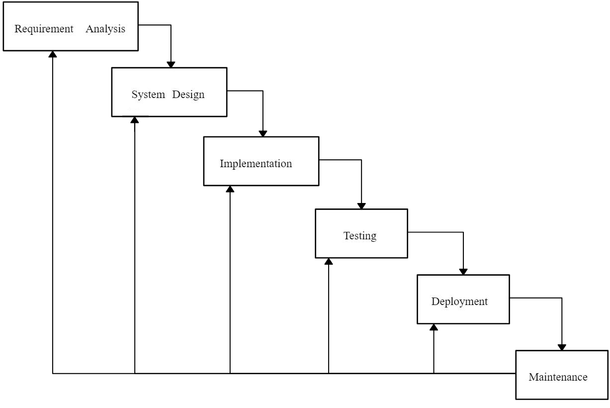

# Software Engineering

**Software engineering** is a branch of both computer science and engineering focused on designing, developing, testing, and maintaining software applications. It involves applying engineering principles and computer programming expertise to develop software systems that meet user needs.  

Software is the product with the set of instructions, programs used to operate the computer and to perform the specific tasks. The programs will execute within a computer of any size and architecture.Software is a program or set of programs containing instructions that provide desired functionality. And Engineering is the process of designing and building something that serves a particular purpose and finds a cost-effective solution to problems.

## Legacy Software

The older programs which are developed decades ago that are still in use by performing modifications in order to meet the business requirements. The rapid increase of such systems may cause the risk to the larger organizations as they may require outdated hardware and operating system.  

### Who uses Legacy Software?

Here are some companies that may use legacy software:

1. **Background checking organizations:** Industries that perform background checks, like law enforcement and human resources (HR), may use legacy software due to the high volume of information and the complexity of the background checking system. Transferring the information to a newer system is challenging for organizations since data loss is risky.
2. **Banks:** It's common for banks to use legacy software since they handle accounts and transactions over long periods. They may use outdated software to ensure their accounts and transactions remain unchanged.
3. **Retail:** Companies in the retail industry may use legacy software so that they don't have to update all of their sales terminals. For example, if a grocery store uses older cash registers, it may cost less to repair them than to buy new ones for the entire store.

## Software Engineering Ethics

- Like other engineering disciplines, software engineering is carried out within a social and legal framework that limits the freedom of people working in that area.
- As a software engineer, you must accept that your job involves wider responsibilities than simply the application of technical skills.
- You must also behave in an ethical and morally responsible way if you are to be respected as a professional engineer.
- It goes without saying that you should uphold normal standards of honesty and integrity. You should not use your skills and abilities to behave in a dishonest way or in a way that will bring disrepute to the software engineering profession.
- However, there are areas where standards of acceptable behavior are not
bound by laws but by the more tenuous notion of professional
responsibility. Some of these are:
  1. **Confidentiality:** You should normally respect the confidentiality of your employers or clients irrespective of whether or not a formal confidentiality agreement has been signed.
  2. **Competence:** You should not misrepresent your level of competence. You should not knowingly accept work that is outside your competence.
  3. **Intellectual property rights:** You should be aware of local laws governing the use of intellectual property such as patents and copyright. You should be careful to ensure that the intellectual property of employers and clients is protected.
  4. **Computer misuse:** You should not use your technical skills to misuse other people’s computers. Computer misuse ranges from relatively trivial (game playing on an employer’s machine) to extremely serious (dissemination of viruses or other malware).

## Software Development Myths

Erroneous beliefs about software and the process that is used to build it.

- Management myths
- Customer myths
- Practitioner’s myths

### Management myths

**Myth:** If we get behind schedule, we can add more programmers and catch up ( “Mongolian horde” concept).  
**Reality:**
- Software development is not a mechanistic process like manufacturing.
- In the words of Brooks “adding people to a late software project makes it later.” At first, this statement may seem counterintuitive.
- However, as new people are added, people who were working must spend time educating the newcomers, thereby reducing the amount of time spent on productive development effort.
- People can be added but only in a planned and well-coordinated manner.

### Customer myths

**Myth:** A general statement of objectives is sufficient to begin writing programs—we can fill in the details later.  
**Reality:**
- Although a comprehensive and stable statement of requirements is not always possible, an ambiguous “statement of objectives” is a recipe for disaster.
- Unambiguous requirements (usually derived iteratively) are developed only through effective and continuous communication between customer and developer.

### Practitioner’s myths

**Myth:** Once we write the program and get it to work, our job is done.  
**Reality:**
- Industry data indicate that between 60 and 80 percent of all effort expended on software will be expended after it is delivered to the customer for the first time.

### Software Process Models

  

  
<b>Figure:</b> Waterfall Model

  

